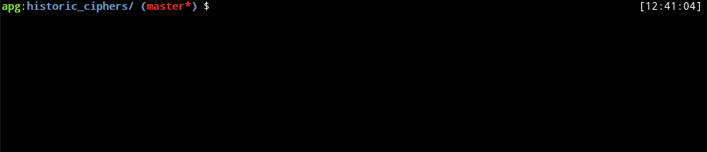

# Historic Ciphers
## Caecar Cipher
An implementation of the historical caesar cipher in python3.

In cryptography, a Caesar cipher, also known as Caesar's cipher, the shift cipher, Caesar's code or Caesar shift, is one of the simplest and most widely known encryption techniques. It is a type of substitution cipher in which each letter in the plaintext is replaced by a letter some fixed number of positions down the alphabet. For example, with a left shift of 3, D would be replaced by A, E would become B, and so on. The method is named after Julius Caesar, who used it in his private correspondence. [wikipedia](https://en.wikipedia.org/wiki/Caesar_cipher)

## Simple Substitution Cipher
The simple substitution cipher is a cipher that has been in use for many hundreds of years (an excellent history is given in Simon Singhs 'the Code Book'). It basically consists of substituting every plaintext character for a different ciphertext character. It differs from the Caesar cipher in that the cipher alphabet is not simply the alphabet shifted, it is completely jumbled. ()[practical cryptography](http://practicalcryptography.com/ciphers/simple-substitution-cipher)

